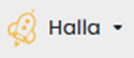

# Get Started

_DALDAL WALLET is prepared for you with two different types._

* [_www.daldal.io_](http://daldal.io) _is for MainNet of FINL._
* [_halla.daldal.io_](http://halla.daldal.io) _is for Halla(TestNet of FINL)._
  * _TestNet is available for **testing purposes only**._
  * _The result of TestNet is **NOT** applied on the MainNet._

_MainNet and Halla(TestNet of FINL) **are totally separated.**_

_Please check and make sure about the type of wallet before you use the DALDAL WALLET._

<figure><figcaption></figcaption></figure>  __  <figure><figcaption></figcaption></figure>