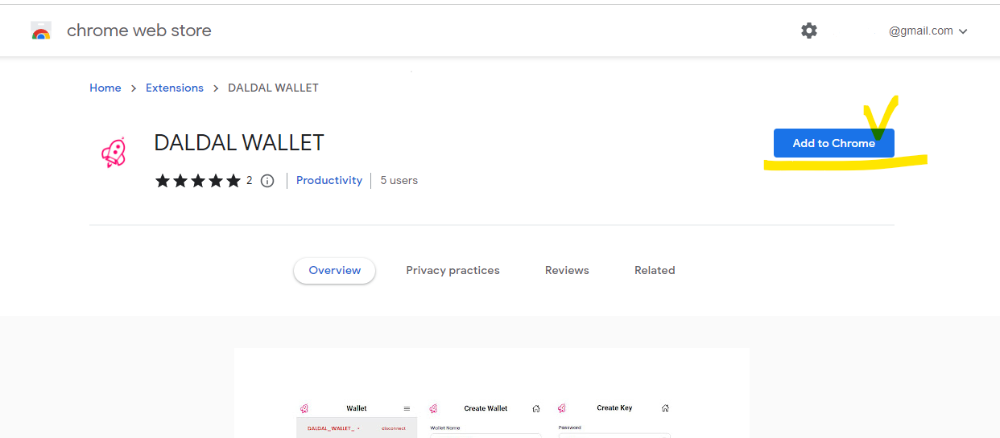
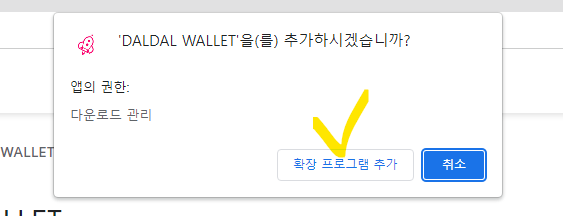
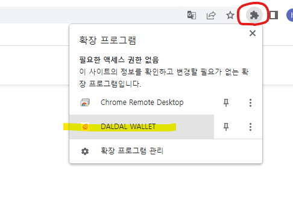
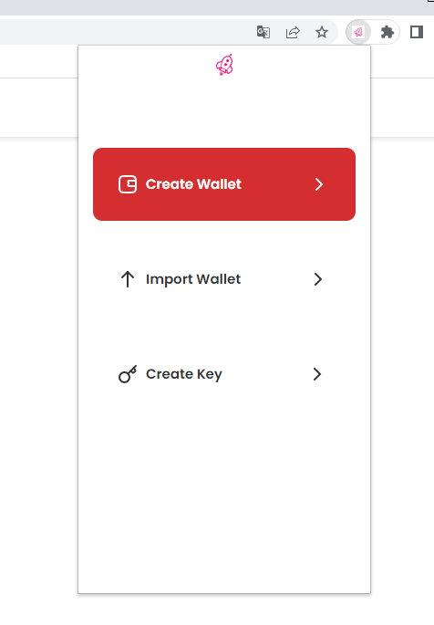

# DalDal Wallet Extension for CHROME

> You can get download DalDal Wallet Extension for Chrome from the link below.

[Chrome Web Store - DALDAL WALLET](https://chrome.google.com/webstore/detail/daldal-wallet/chpijpegbmmcdkcednimifhdjbfghngm?hl=en)

<figure><figcaption></figcaption></figure>
1. Click the block shape on the top and press the DALDAL-WALLET to add it to your Chrome.
<figure><figcaption></figcaption></figure>
2. Screen that appears when the download is complete/.
<figure><figcaption></figcaption></figure>
3. Now you can use DalDal Wallet without access to the www.daldal.io through the Chrome Extension.
<figure><figcaption></figcaption></figure>